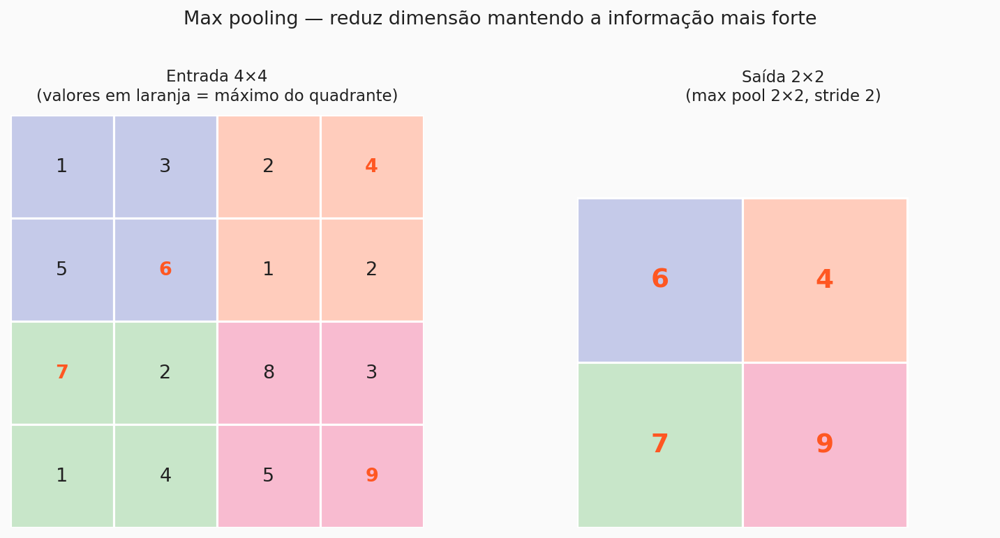
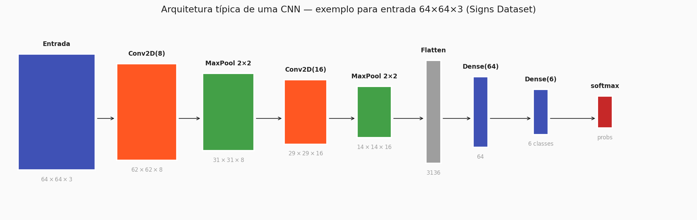

# Arquitetura de uma CNN

Na página anterior, você viu a convolução como uma operação isolada. Nesta, vamos montar as peças: **pooling** para reduzir rápido as dimensões, **fully-connected** para transformar a representação final em uma decisão, e **o encadeamento típico** dessas camadas em uma CNN de ponta a ponta.

---

## 1. Pooling — reduzir mantendo o essencial

Convoluções encolhem a imagem um pouco, mas devagar. Para classificar, geralmente precisamos sair de 64×64 e chegar em uma representação bem compacta — digamos, um vetor de algumas centenas de valores — antes das camadas densas finais.

A operação de **pooling** faz essa redução de forma bruta: divide o feature map em blocos pequenos (tipicamente 2×2) e resume cada bloco em **um único número**.

A versão mais usada é o **max pooling**, que pega o **maior valor** de cada bloco:



- Entrada 4×4 → saída 2×2: redução de 4 células para 1.
- Nenhum peso. Nenhum parâmetro a ajustar. É só uma operação matemática fixa.
- Metade da resolução em altura **e** largura → um quarto do número total de células.

!!! info "Por que max em vez de, digamos, média?"
    A intuição é direta: um feature map guarda, em cada célula, **o quanto um determinado padrão ativou naquela posição**. O que interessa geralmente é "esse padrão **apareceu** em algum lugar deste bloco?" — e esse "em algum lugar" é exatamente o que o máximo captura. Se o padrão ativou forte em um dos quatro pixels, o max propaga essa informação; os três zeros ao redor não diluem o sinal, como aconteceria com a média.

### Average pooling

Existe também o **average pooling**, que calcula a média do bloco em vez do máximo. É menos usado em camadas intermediárias, mas aparece no final de algumas arquiteturas modernas como **global average pooling** — um pooling onde o bloco é a **camada inteira**, produzindo um único valor por feature map. Voltaremos nele mais adiante.

---

## 2. Fully-connected — a decisão final

Depois de uma sequência de `Conv → ReLU → Pool`, o feature map está pequeno e profundo. Nesse ponto, ele já é uma **representação rica** da imagem: cada canal responde por um padrão específico aprendido durante o treino.

Para transformar essa representação em uma classificação, fazemos duas coisas:

1. **Flatten** — achatamos o tensor 3D final em um vetor 1D. (Sim, o flatten que era proibido no início do pipeline agora volta — com uma diferença crucial: aqui ele acontece **depois** de toda a hierarquia de features já ter sido extraída respeitando a estrutura 2D. O que está sendo achatado não é mais "pixels crus", e sim "padrões aprendidos".)
2. **Dense layers** — empilhamos uma ou duas camadas densas comuns (o mesmo tipo da aula 4) até chegar na saída.

Para **classificação multiclasse**, a última camada tem tantos neurônios quanto classes e usa **softmax** como ativação — transformando scores em probabilidades que somam 1. Você já viu exatamente esse padrão na aula 4.

---

## 3. A arquitetura típica

Juntando tudo, uma CNN clássica segue o padrão:

$$
\text{Input} \;\to\; [\text{Conv} \to \text{ReLU} \to \text{Pool}] \times N \;\to\; \text{Flatten} \;\to\; \text{Dense} \;\to\; \text{Output}
$$

Dois movimentos guiam a escolha dos hiperparâmetros dessa pilha:

- **A resolução espacial diminui**. Cada `Pool` corta altura e largura pela metade.
- **A profundidade aumenta**. Cada `Conv` costuma ter mais kernels que a anterior (8 → 16 → 32 → 64 …). A ideia intuitiva: camadas rasas aprendem muitos padrões baixos (bordas, cantos); camadas profundas combinam esses padrões em estruturas mais específicas, e é natural precisar de mais "espaço" para guardá-los.



<!-- ANIMAÇÃO PENDENTE: GIF passando uma imagem camada por camada pela arquitetura, mostrando como os feature maps evoluem de "edges simples" para "padrões complexos" -->
!!! note "🎬 Animação pendente"
    Espaço reservado para GIF mostrando uma imagem sendo processada camada por camada, com os feature maps evoluindo de padrões simples (bordas) para padrões complexos (partes de objetos).

---

## 4. Um exemplo completo — passeio pelas dimensões

Aplicando a arquitetura do diagrama a uma entrada do **Signs Dataset** (64×64×3, 6 classes), conseguimos acompanhar as dimensões camada por camada:

| Camada | Operação | Forma da saída | Parâmetros |
|---|---|---|---:|
| 0 | *Entrada* | 64×64×3 | 0 |
| 1 | `Conv2D(8, (3,3))` + ReLU | 62×62×8 | 224 |
| 2 | `MaxPooling2D((2,2))` | 31×31×8 | 0 |
| 3 | `Conv2D(16, (3,3))` + ReLU | 29×29×16 | 1 168 |
| 4 | `MaxPooling2D((2,2))` | 14×14×16 | 0 |
| 5 | `Flatten()` | 3 136 | 0 |
| 6 | `Dense(64)` + ReLU | 64 | 200 768 |
| 7 | `Dense(6)` + softmax | 6 | 390 |
| | **Total** | | **≈ 202 mil** |

!!! tip "Compare com o MLP"
    Um MLP direto em entrada 64×64×3 com uma primeira camada de 128 neurônios tem **~1,5 milhão de parâmetros** só na entrada. Esta CNN tem **~202 mil no total** — 7× menos — e ainda respeita a estrutura 2D e ganha invariância por translação.

As fórmulas de **tamanho de saída** que você viu na página anterior explicam cada passo da tabela. Repasse a linha da camada 1: entrada 64, kernel 3, stride 1, padding valid → $\lfloor (64-3)/1 \rfloor + 1 = 62$. A saída fica 62×62×8 porque são 8 kernels.

### Parâmetros de cada camada (conta rápida)

- **`Conv2D(8, (3,3))` sobre entrada 64×64×3**: cada um dos 8 kernels é um tensor $3\times3\times3 = 27$ pesos + 1 bias = 28 params por kernel. Total: $8 \times 28 = 224$.
- **`Conv2D(16, (3,3))` sobre entrada 31×31×8**: cada um dos 16 kernels é $3\times3\times8 = 72$ pesos + 1 bias = 73. Total: $16 \times 73 = 1\,168$.
- **`Dense(64)` sobre 3 136 entradas**: $3\,136 \times 64 + 64 = 200\,768$.

Repare onde está o grosso dos parâmetros: **na camada densa após o flatten**. Esse é um padrão comum em CNNs pequenas, e é o motivo pelo qual arquiteturas modernas às vezes substituem essa densa por um **global average pooling** (um "pool" que reduz cada feature map a um único valor), eliminando milhares de parâmetros.

---

## 5. Em código (Keras)

A arquitetura acima, escrita em Keras, é quase uma transcrição literal:

```
from tensorflow import keras
from tensorflow.keras import layers

model = keras.Sequential([
    layers.Conv2D(8, (3, 3), activation='relu', input_shape=(64, 64, 3)),
    layers.MaxPooling2D(pool_size=(2, 2)),
    layers.Conv2D(16, (3, 3), activation='relu'),
    layers.MaxPooling2D(pool_size=(2, 2)),
    layers.Flatten(),
    layers.Dense(64, activation='relu'),
    layers.Dense(6, activation='softmax'),
])

model.compile(
    optimizer='adam',
    loss='categorical_crossentropy',
    metrics=['accuracy'],
)
```

Alguns pontos para registrar:

- `input_shape=(64, 64, 3)` só é necessário na **primeira** camada. Daí para frente, o Keras infere as formas sozinho.
- `activation='relu'` na camada convolucional é a forma compacta de dizer `Conv2D(...) → ReLU`. É equivalente a separar em duas camadas, só mais legível.
- A última camada é `Dense(6, activation='softmax')` — 6 classes, saída em probabilidades. Par de `loss='categorical_crossentropy'`.
- `model.summary()` é seu melhor amigo para inspecionar formas e contagem de parâmetros.

!!! warning "Um aviso honesto"
    Essa CNN é propositalmente simples, ideal para treinar rápido em um notebook. Arquiteturas de produção adicionam muito mais coisas: batch normalization entre camadas, regularização com dropout, data augmentation, mais blocos conv+pool. Não se preocupe com isso agora — o ponto é você entender o esqueleto. Os detalhes vêm nas próximas aulas.

---

## 6. Explorando ao vivo — CNN Explainer

Os pesquisadores do Polo Club of Data Science (Georgia Tech) construíram uma ferramenta interativa excelente para entender como uma CNN real processa uma imagem, camada por camada. Abra-a abaixo e passe o mouse sobre qualquer feature map para ver os pesos do kernel e a operação acontecendo em zoom.

<div class="cnn-explainer-wrapper">
  <div class="cnn-explainer-header">
    <span class="cnn-explainer-title">⬡ CNN Explainer — Polo Club, Georgia Tech</span>
    <span class="cnn-explainer-hint">Passe o mouse sobre qualquer camada para inspecionar kernels e ativações</span>
  </div>
  <iframe
    src="https://poloclub.github.io/cnn-explainer/"
    width="100%"
    height="720"
    frameborder="0"
    title="CNN Explainer"
    loading="lazy">
  </iframe>
</div>

!!! NOTE "Se o iframe não carregar"
    Acesse diretamente em [poloclub.github.io/cnn-explainer](https://poloclub.github.io/cnn-explainer/).

---

## Fechando

Você agora tem um modelo mental completo de uma CNN:

- **Convoluções** extraem padrões espaciais localmente, com pesos compartilhados.
- **Pooling** reduz dimensão de forma barata, preservando os sinais mais fortes.
- **Flatten + Dense + Softmax** transformam a representação final em uma classificação.
- A **arquitetura típica** alterna conv+pool, aprofundando os canais e reduzindo a resolução, até chegar em uma saída que cabe em uma camada densa pequena.

??? question "Teste de intuição antes de seguir"
    - Em uma CNN, a **profundidade** (número de canais) **aumenta** ou **diminui** conforme descemos a rede? Por quê? *(aumenta — camadas mais profundas guardam combinações mais específicas, que exigem mais "espaço")*
    - Por que o max pooling não tem parâmetros para aprender? *(porque é uma operação fixa; não há pesos — apenas a regra "pegue o maior")*
    - Na arquitetura do exemplo, qual é a camada com **mais** parâmetros? *(a `Dense(64)` logo após o flatten, com ~200 mil — bem mais que qualquer camada conv)*

A próxima página te prepara para colocar tudo isso em prática no notebook.

---

<style>
.cnn-explainer-wrapper {
  border: 1px solid var(--md-typeset-table-color, #e0e0e0);
  border-radius: 10px;
  overflow: hidden;
  margin: 2rem 0;
  box-shadow: 0 4px 20px rgba(0,0,0,0.08);
}

.cnn-explainer-header {
  display: flex;
  align-items: center;
  justify-content: space-between;
  padding: 0.75rem 1.25rem;
  background: var(--md-primary-fg-color, #4a90d9);
  color: white;
  font-family: monospace;
  font-size: 0.85rem;
  flex-wrap: wrap;
  gap: 0.5rem;
}

.cnn-explainer-title {
  font-weight: bold;
  font-size: 0.95rem;
  letter-spacing: 0.05em;
}

.cnn-explainer-hint {
  opacity: 0.85;
  font-size: 0.78rem;
}

.cnn-explainer-wrapper iframe {
  display: block;
  width: 100%;
  border: none;
}
</style>

!!! Author
    - **Vitor Salomão**

<div class="handout-nav" markdown>
[← Anterior: A operação de convolução](convolucao.md){ .md-button }
[Próxima: Prática →](pratica_handout.md){ .md-button .md-button--primary }
</div>
