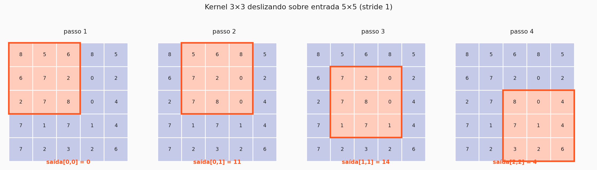
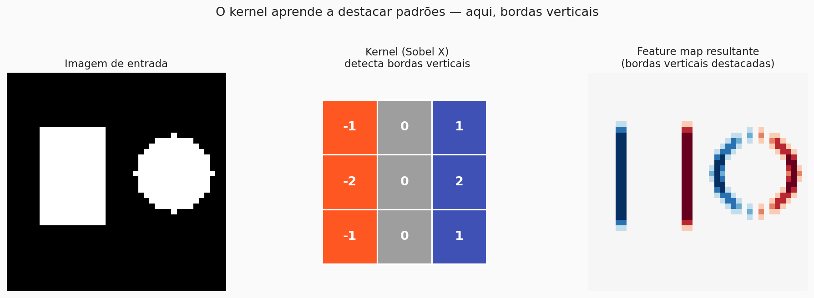
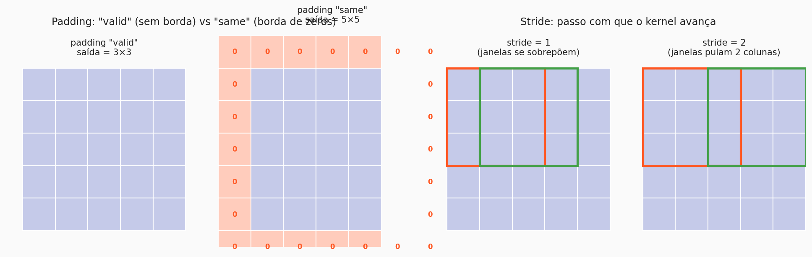
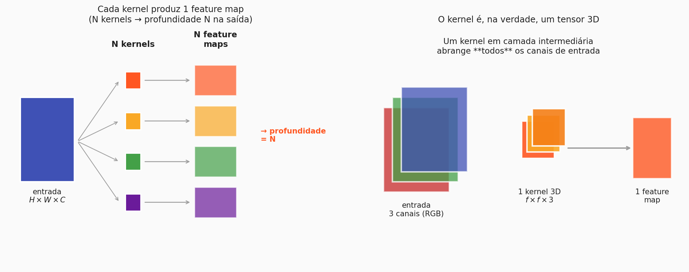

# A operação de convolução

Se as CNNs são a resposta aos problemas que o MLP tem com imagens, a **convolução** é o motor dessa resposta. É uma operação surpreendentemente simples: passe uma pequena matriz (o **kernel**) por cima da imagem e, a cada posição, faça uma soma ponderada dos pixels cobertos por ela.

O resultado é um novo mapa 2D, o **feature map**, que destaca onde na imagem original aparecem os padrões que aquele kernel "gosta".

---

## 1. O mecanismo: um kernel deslizando

Um **kernel** (ou **filtro**) é apenas uma matriz pequena de pesos. Tamanhos típicos são 3×3 ou 5×5. Ele é aplicado da seguinte forma:

1. Alinhe o kernel com um pedaço da imagem do mesmo tamanho.
2. Multiplique cada peso pelo pixel correspondente.
3. Some tudo. Esse número vira **uma célula** do feature map.
4. Desloque o kernel para a próxima posição e repita.

Os quatro quadros acima são os quatro primeiros passos dessa varredura. A parte laranja destaca os pixels cobertos pelo kernel; o valor embaixo é o resultado daquela posição. Depois de varrer toda a imagem, você obtém um **feature map** 2D menor que a entrada.

!!! info "Nota importante"
    Os pesos do kernel **não são definidos por você**. Quando construímos uma camada como `Conv2D(8, (3,3))` no Keras, estamos dizendo "crie 8 kernels 3×3 com pesos aleatórios, e ajuste esses pesos durante o treino". O que o kernel acaba detectando é **aprendido** — exatamente como os pesos de um MLP.

<!-- ANIMAÇÃO PENDENTE: GIF de um kernel 3×3 deslizando sobre uma imagem, com os pixels e os valores se atualizando a cada passo -->
!!! note "🎬 Animação pendente"
    Espaço reservado para GIF mostrando o kernel 3×3 deslizando sobre uma imagem em tempo real, com o feature map sendo preenchido célula por célula.

---

## 2. O que um kernel **detecta** — intuição visual

Até aqui a convolução parece puramente mecânica. Mas cada kernel tem uma "personalidade": dependendo dos seus pesos, ele responde fortemente a um tipo específico de padrão.

Um exemplo clássico é o **kernel de Sobel**, usado historicamente para detecção de bordas verticais:

- **Entrada**: uma imagem com dois objetos (um quadrado e um círculo).
- **Kernel**: pesos positivos à direita, negativos à esquerda, zero no meio. Esse padrão de sinal faz o kernel produzir valores altos **onde a imagem muda da esquerda para a direita** — ou seja, bordas verticais.
- **Feature map**: o vermelho e o azul marcam as transições. O meio liso dos objetos fica em zero.

!!! tip "Por que isso é mágico"
    Um único kernel de 3×3 — **9 números** — é capaz de destacar uma propriedade estrutural da imagem. Em uma CNN real, esses 9 números são aprendidos durante o treino. A rede descobre sozinha quais padrões vale a pena detectar.

<!-- ANIMAÇÃO PENDENTE: GIF mostrando diferentes kernels (edge horizontal, vertical, blur, sharpen) aplicados a uma imagem real, cada um produzindo um feature map diferente -->
!!! note "🎬 Animação pendente"
    Espaço reservado para GIF comparando diferentes kernels (edge horizontal/vertical, blur, sharpen) aplicados à mesma imagem, evidenciando que cada kernel destaca um padrão diferente.

---

## 3. Stride e padding

O kernel não precisa avançar de um em um, nem a imagem precisa ser varrida exatamente no tamanho original. Dois parâmetros controlam isso:

### Stride — o passo do kernel

**Stride** é de quantos pixels o kernel avança a cada passo.

- `stride = 1` — o kernel avança um pixel por vez. As janelas se sobrepõem. O feature map resultante é quase do tamanho da imagem.
- `stride = 2` — o kernel pula dois pixels. O feature map sai com metade da resolução. É uma forma barata de reduzir dimensionalidade.

### Padding — a borda da imagem

Uma convolução sem ajustes **diminui** a imagem (um kernel 3×3 cabe em $H-2$ posições por linha). Se fizermos isso em muitas camadas seguidas, a imagem some. Para evitar isso existe o **padding**:

- **`valid`** — sem padding. A imagem encolhe a cada convolução. É o *default*.
- **`same`** — adicionamos uma borda de zeros ao redor da imagem, dimensionada exatamente para que a **saída tenha o mesmo tamanho da entrada**.

---

## 4. Fórmula do tamanho de saída

Juntando tamanho da entrada, tamanho do kernel, stride e padding, o tamanho de saída é:

$$n_H = \Bigl\lfloor \frac{n_{H_{prev}} - f}{stride} \Bigr\rfloor + 1$$

$$n_W = \Bigl\lfloor \frac{n_{W_{prev}} - f}{stride} \Bigr\rfloor + 1$$

$$n_C = n_{C_{prev}}$$

Onde:

- $n_{H_{prev}}, n_{W_{prev}}$: altura e largura da entrada
- $f$: tamanho do kernel (ex.: 3 para um kernel 3×3)
- $stride$: passo do kernel
- $n_C$: número de canais de saída (definido pelo número de kernels, discutido na próxima seção)

A notação $\lfloor \cdot \rfloor$ é a *função piso* — arredonda para baixo. Ela aparece porque a divisão pode não dar um inteiro exato (e você não pode ter "meio pixel" de saída).

!!! tip "Exemplo numérico (entrada 64×64×3, kernel 3×3, stride 1, padding valid)"
    Substituindo:

    $$n_H = \Bigl\lfloor \frac{64 - 3}{1} \Bigr\rfloor + 1 = 62$$

    $$n_W = \Bigl\lfloor \frac{64 - 3}{1} \Bigr\rfloor + 1 = 62$$

    Saída: **62×62×(número de kernels)**. Ou seja, uma camada `Conv2D(8, (3,3))` aplicada a uma imagem 64×64×3 produz um feature map de **62×62×8**.

    Esses 2 pixels perdidos por lado vêm do fato de que o kernel 3×3 precisa caber inteiro dentro da imagem.

---

## 5. Depth — o que acontece com os canais

A fórmula de cima deixou uma pergunta em aberto: de onde vem o número de canais $n_C$ da saída? E o que acontece quando a entrada já é colorida (3 canais) ou já passou por uma convolução anterior (N canais)?

Duas ideias se juntam aqui:

### N kernels produzem N feature maps

Quando você define `Conv2D(8, (3,3))`, está criando **8 kernels independentes**. Cada um deles varre a imagem como descrito na Seção 1 e produz **seu próprio feature map**. Ao empilhar os 8 feature maps, a saída ganha profundidade 8.

### Cada kernel "cobre" todos os canais da entrada

Quando a entrada tem múltiplos canais (RGB ou camadas anteriores), o kernel **não é uma matriz 2D** — ele é um tensor 3D do mesmo "profundidade" da entrada. Um kernel 3×3 aplicado a uma entrada com 3 canais tem **3×3×3 = 27 pesos**, e ele integra informação dos três canais ao produzir uma única célula do feature map.

Em outras palavras: a profundidade da saída é decidida **pelo número de kernels**. A profundidade de cada kernel é decidida **pelo número de canais da entrada**.

!!! info "Resumindo em uma frase"
    Um kernel 3×3 aplicado a uma entrada $H \times W \times C$ é um tensor $3 \times 3 \times C$ que produz **um** feature map. Se você tem $N$ kernels, a saída é $H' \times W' \times N$.

---

## 6. Ativação: e por que praticamente sempre ReLU

Assim como no MLP, a saída da convolução passa por uma **função de ativação** antes de virar entrada da próxima camada. Sem ela, empilhar dezenas de camadas de convolução seria exatamente equivalente a ter **uma** — todas as transformações lineares colapsariam em uma única.

Você já encontrou algumas ativações antes:

- **Sigmoide**, que comprime em $(0, 1)$.
- **Tanh**, que comprime em $(-1, 1)$.
- **ReLU**, que zera valores negativos e deixa positivos passarem: $\max(0, z)$.

Em CNNs, as duas primeiras praticamente **não são usadas nas camadas ocultas**. O motivo é o mesmo problema que você viu nas redes densas profundas: o **vanishing gradient**. Sigmoide e tanh *saturam* — suas derivadas ficam próximas de zero para entradas muito positivas ou muito negativas. Como o backpropagation multiplica essas derivadas camada por camada, o gradiente que chega nas primeiras camadas de uma rede profunda é praticamente zero. A rede trava.

A ReLU resolve isso de forma quase trivial:

- Para $z > 0$, a derivada é **constante e igual a 1** — nada de saturação.
- Para $z < 0$, o neurônio simplesmente desliga, o que na prática funciona como uma **esparsidade natural** (uma fração dos neurônios fica inativa a cada entrada).
- Computacionalmente, é só uma comparação com zero — ordens de grandeza mais rápida que exponenciais.

!!! tip "Variantes da ReLU"
    Existem variantes — **Leaky ReLU**, **ELU**, **GELU** — que tentam corrigir pequenos problemas da ReLU clássica (neurônios que "morrem" e nunca mais ativam). Para a esmagadora maioria dos casos introdutórios, **ReLU padrão basta**. A partir de agora, assuma que toda camada convolucional tem uma ReLU acoplada a ela (exceto a saída, onde outra ativação é usada dependendo da tarefa).

---

## Fechando

Nesta página você viu:

- A **convolução** como um kernel pequeno varrendo a imagem e produzindo um feature map.
- O que um kernel detecta depende dos seus **pesos** — que são aprendidos no treino.
- **Stride** e **padding** controlam como o kernel anda e se a imagem é acolchoada.
- A profundidade da saída é definida pelo **número de kernels**; a profundidade de cada kernel é definida pelos **canais de entrada**.
- **ReLU** é a ativação padrão após cada convolução.

Mas ainda falta uma peça. Convolução reduz um pouco a imagem (via `valid` ou stride 2), mas para chegar numa saída pequena o suficiente para uma classificação, precisamos de algo mais agressivo. E precisamos de um jeito de, no final, juntar todos os feature maps em uma decisão final. Esse é o tema da próxima página.

??? question "Para checar sua intuição"
    - Uma `Conv2D(32, (5,5), padding='same')` aplicada a uma entrada 28×28×1 produz uma saída com qual forma? *(28×28×32 — padding "same" preserva o tamanho espacial; 32 kernels produzem 32 feature maps)*
    - Por que não empilhamos 10 convoluções lineares sem ativação? *(porque 10 transformações lineares em sequência = 1 transformação linear; a rede inteira viraria uma única camada)*
    - Se um kernel é 3×3 e a entrada tem 16 canais, quantos pesos esse kernel tem? *(3·3·16 = 144 pesos, mais 1 bias)*

---

!!! Author
    - **Vitor Salomão**

[← Anterior: Por que MLPs falham em imagens](visao_computacional.md){ .md-button }
[Próxima: Arquitetura de uma CNN →](arquitetura_cnn.md){ .md-button .md-button--primary }

