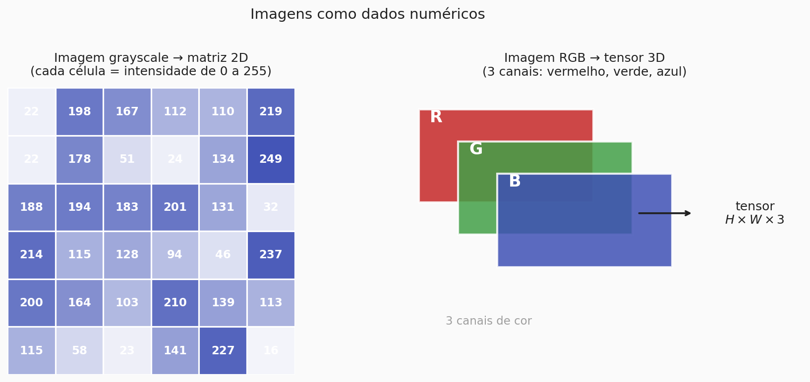
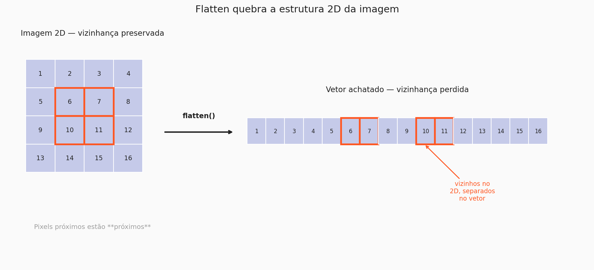
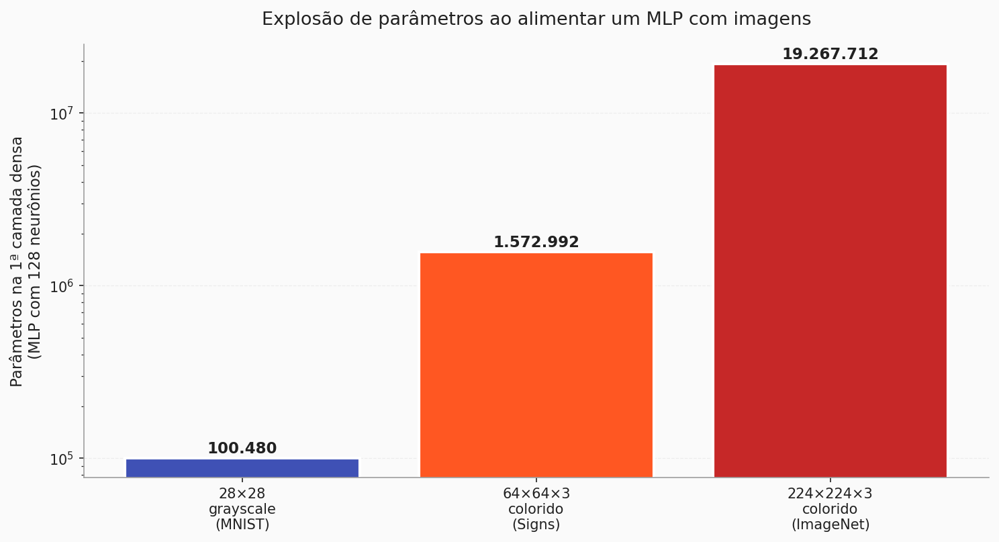
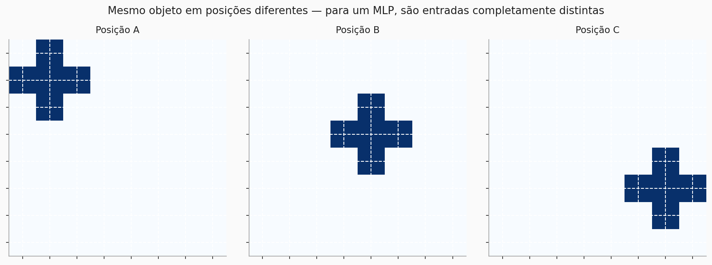

# Por que MLPs falham em imagens

Nos capítulos anteriores, vimos como um **MLP** processa dados tabulares e até imagens pequenas quando elas são achatadas em um vetor. Aquilo funcionou para o Fashion MNIST (28×28, escala de cinza), mas esconde um problema sério: assim que a imagem fica um pouco maior — digamos 64×64 colorida — o MLP começa a quebrar. Esta página é sobre entender **por quê**, em três ângulos diferentes.

---

## 1. Imagens são tensores, não vetores

Antes de discutir qualquer modelo, vale fixar como uma imagem é representada numericamente.

- Uma imagem **em escala de cinza** é uma **matriz 2D** de pixels. Cada célula guarda um número entre 0 (preto) e 255 (branco).
- Uma imagem **colorida** é um **tensor 3D** com três canais: vermelho, verde e azul. A forma é $H \times W \times 3$ — altura × largura × 3 canais.

O ponto é simples, mas importante: **os pixels não são aleatórios**. Eles têm uma estrutura espacial. Pixels vizinhos tendem a fazer parte do mesmo objeto, da mesma borda, da mesma textura. Qualquer modelo que ignore essa estrutura está jogando informação fora.

---

## 2. Achatar quebra a vizinhança

O primeiro problema aparece assim que uma imagem entra em um MLP. Para que a rede totalmente conectada funcione, a imagem precisa virar um vetor:

$$
\text{imagem 2D } (H \times W) \;\longrightarrow\; \text{vetor 1D } (H \cdot W)
$$

Parece inofensivo — afinal, nenhum pixel foi removido. Mas a operação de **flatten** destrói uma informação que o modelo nunca mais recupera: **quais pixels são vizinhos no plano**.

Olhe os quatro pixels destacados em laranja no lado esquerdo. No 2D, eles formam um bloco compacto. Depois do flatten, eles viram os índices 6, 7, 10 e 11 do vetor — dois deles vizinhos no vetor, dois deles separados por linhas inteiras da matriz original.

O MLP, que trata cada entrada como independente, **não tem como saber que (7) e (10) deviam estar próximos**. Ele precisaria *reaprender* essa estrutura sozinho, a partir dos dados — e para isso faria falta muitíssimo mais exemplos.

!!! info "A ideia central"
    O MLP não é ruim porque erra cálculos. Ele é ruim para imagens porque **trata a imagem como um saco de pixels**, ignorando tudo que faz uma imagem ser uma imagem: a vizinhança espacial.

---

## 3. O número de parâmetros explode

O segundo problema é puramente quantitativo. Uma camada totalmente conectada precisa de um peso para cada par *(entrada, neurônio)*. Quando a entrada é uma imagem achatada, o número de pesos fica assustador.

Considere o mesmo MLP — uma primeira camada densa com **128 neurônios** — aplicado a três entradas diferentes:

| Entrada | Params da 1ª camada densa |
|---|---:|
| 28×28 grayscale (MNIST) | ≈ 100 mil |
| 64×64×3 (Signs Dataset) | ≈ 1,5 milhão |
| 224×224×3 (ImageNet) | ≈ 19 milhões |

E isso é só **a primeira camada**. Em qualquer arquitetura com profundidade razoável, o total passa rapidamente de centenas de milhões de pesos, quase todos aprendendo padrões espaciais triviais que poderiam ser compartilhados. É desperdício de capacidade — e de GPU.

!!! warning "Por que isso é um problema na prática"
    Muitos parâmetros + poucos dados = **overfitting garantido**. A rede tem capacidade sobrando para decorar o treino em vez de generalizar. Em imagens, isso aparece logo: a acurácia de treino chega em 99% e a de validação trava muito abaixo.

---

## 4. O mesmo objeto em posições diferentes é um problema novo

O terceiro problema é o mais fácil de visualizar. Imagine um modelo treinado para reconhecer um "+" no centro da imagem. Agora o mesmo sinal aparece no canto superior esquerdo:

Para o MLP, essas três imagens são **entradas completamente distintas**. Os pixels ativados são outros, a ordem no vetor achatado é outra, e os pesos que reconheciam o padrão no centro estão lá, inúteis, enquanto a rede tenta aprender o mesmo padrão de novo em cada nova posição.

A propriedade que está faltando aqui tem nome: **invariância por translação**. Um bom modelo de imagens deveria reconhecer o mesmo objeto independentemente de onde ele apareça. E para conseguir isso sem re-treinar do zero para cada posição, o modelo precisa **compartilhar parâmetros entre regiões da imagem**.

---

## 5. Então, o que é uma CNN?

Os três problemas acima — quebra de vizinhança, explosão de parâmetros, falta de invariância — não são três problemas independentes. Eles têm **a mesma raiz**: o MLP trata cada pixel como uma entrada isolada e usa um peso distinto para cada par (pixel, neurônio).

Uma **Rede Neural Convolucional (CNN)** é, essencialmente, a resposta a essa raiz. A ideia é trocar a camada totalmente conectada por um operador com três propriedades:

- **Local** — olha para uma pequena janela da imagem por vez (3×3, 5×5), respeitando a vizinhança.
- **Compartilhado** — a mesma janela (com os mesmos pesos) é aplicada em **todas** as posições da imagem. Se o padrão funciona no centro, funciona no canto.
- **Hierárquico** — empilhando várias dessas operações, as camadas mais rasas aprendem padrões simples (bordas, cantos) e as mais profundas aprendem combinações (texturas, partes, objetos inteiros).

Esse operador local e compartilhado é a **convolução**. É ele que faz uma CNN ter ordens de grandeza menos parâmetros que um MLP equivalente, respeitar a estrutura 2D e ganhar uma invariância por translação "de graça".

É o que vamos dissecar na próxima página.

??? question "Autoteste rápido"
    Antes de seguir, tente responder de cabeça:

    - Se eu tenho uma imagem 100×100 grayscale e quero uma primeira camada densa com 64 neurônios, quantos parâmetros eu preciso? (resposta: 100·100·64 + 64 = 640 064)
    - Por que isso é ruim? (dica: quantos exemplos de treino você tem?)
    - Sem compartilhamento de pesos, o que o modelo precisaria fazer para reconhecer o mesmo objeto em duas posições diferentes? (resposta: aprender o padrão **duas vezes**, do zero)

    Se as três respostas saíram rapidamente, você já tem a intuição do que justifica a existência das CNNs.

---

!!! Author
    - **Vitor Salomão**

[← Anterior: Visão Geral](index.md){ .md-button }
[Próxima: A operação de convolução →](convolucao.md){ .md-button .md-button--primary }

