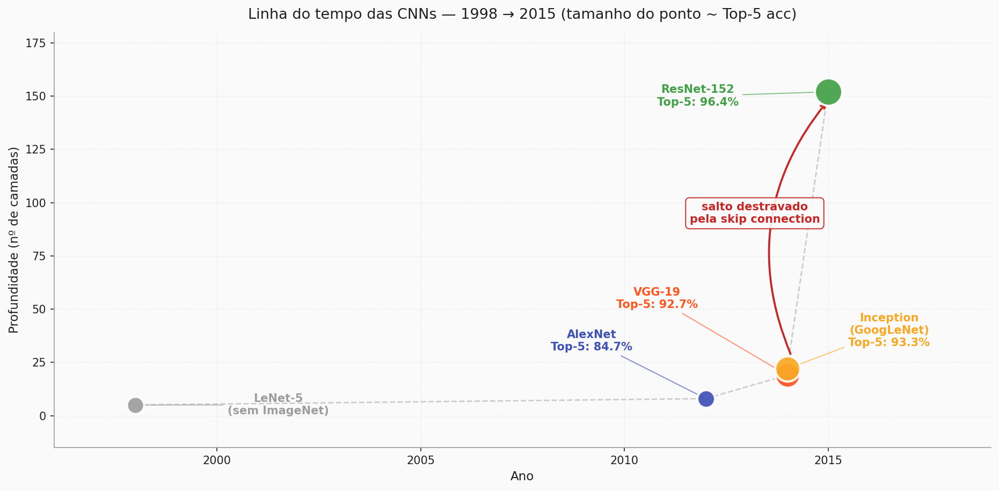
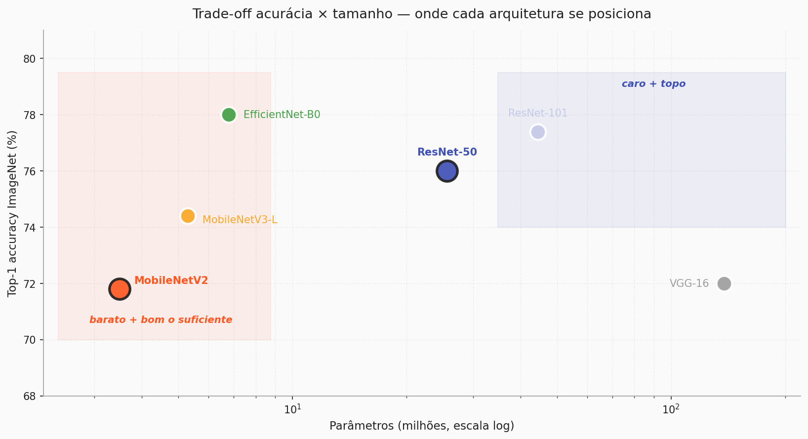
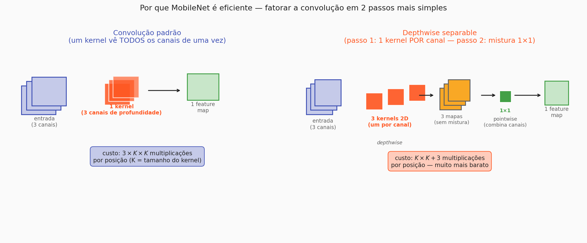

# Arquiteturas de CNNs

Na página anterior a gente chegou à ResNet — mas assumir que "ResNet é a resposta para tudo em visão computacional" seria injusto com os últimos 25 anos de pesquisa. A ResNet é uma entre várias arquiteturas importantes, e entender **por que existem várias** é o passo que falta para a prática fazer sentido.

Esta página é um passeio curto pelas CNNs marcantes, com foco no que interessa quando você sai do paper e vai para o projeto real: *acurácia, tamanho, latência, consumo*. No fim, você vai entender por que a escolha padrão para projetos aplicados em 2026 dificilmente é a ResNet "do livro" — e por que a rede que a gente vai usar na prática é a **MobileNetV2**.

---

## 1. Não existe "a melhor CNN"

Se existisse uma CNN estritamente superior a todas as outras, ninguém mais estaria publicando novas arquiteturas. A realidade é que toda arquitetura é um compromisso entre quatro eixos:

- **Acurácia** — quão bem ela acerta no dataset-alvo (geralmente medida em Top-1 ou Top-5 accuracy em ImageNet).
- **Tamanho** — quantos parâmetros tem (MB de pesos em disco; ocupação em RAM).
- **Latência** — quanto tempo uma inferência demora (milissegundos por imagem).
- **Consumo** — quanta energia ela queima por inferência (importa em celular, edge, IoT).

Melhorar um desses eixos costuma piorar outro. Redes muito acuradas tendem a ser gordas e lentas. Redes muito leves tendem a perder acurácia. A arquitetura certa depende do seu contexto.

---

## 2. Um tour narrativo pelos marcos

Vale conhecer os principais marcos, pelo menos em linhas gerais, porque muitas ideias que a gente usa hoje nasceram em alguma dessas redes.

- **LeNet-5 (1998, Yann LeCun)** — a bisavó de todas as CNNs modernas. Cinco camadas, treinada para reconhecer dígitos escritos à mão em cheques. Mostrou que convoluções aprendidas por backpropagation funcionavam. Dormiu em um canto do mundo da pesquisa por quase 15 anos.
- **AlexNet (2012)** — venceu o ImageNet com uma margem que parecia ofensiva. Era basicamente uma LeNet crescida e treinada em GPU. É o ponto zero da revolução do *deep learning* moderno.
- **VGG (2014)** — insistiu em uma ideia simples até o talo: empilhar muitas convoluções 3×3 pequenas, uma atrás da outra. Fácil de entender, pesadíssima (VGG-16 tem 138M de parâmetros).
- **Inception / GoogLeNet (2014)** — em vez de empilhar só um tamanho de filtro, processou a mesma entrada em paralelo com vários tamanhos (1×1, 3×3, 5×5) e concatenou os resultados. Complexa por fora, eficiente por dentro.
- **ResNet (2015)** — a skip connection, que você viu na página anterior. Destravou 50, 100, 150+ camadas e virou o padrão arquitetural que praticamente toda rede moderna usa como base.

Nenhuma dessas redes é má; todas resolveram algum gargalo da época. Mas nenhuma delas foi desenhada pensando no mundo em que modelos precisam rodar em celulares ou em servidores baratos.

---

## 3. Restrições do mundo real — quando o laboratório não basta

Uma ResNet-50 tem **25 milhões de parâmetros**. Uma VGG-16 tem **138 milhões**. Para treinar essas redes do zero, você precisa de GPU pesada e horas (ou dias) de compute. Para fazer **inferência** em produção, você precisa de memória e tempo que muitas plataformas simplesmente não têm:

- **Celular** — tempo de inferência precisa caber em milissegundos, o app não pode engolir 500 MB de RAM, e a bateria não pode cair 5% por foto processada.
- **Edge / IoT** — pode não existir GPU. Pode ser uma Raspberry Pi, um microcontrolador, uma câmera de segurança.
- **CPU comum** — quando você não tem GPU decente (Colab gratuito, notebook acadêmico, servidor de baixo custo).
- **Latência em produção** — uma API que responde em 50 ms é muito diferente de uma que responde em 500 ms. Para alguns produtos (tradução em tempo real, carro autônomo), 500 ms é inaceitável.

Sob essas restrições, a pergunta muda: não é mais "qual rede me dá mais 0.5% de Top-1 acc", é "**qual rede me dá acurácia suficiente com orçamento aceitável**?".

Uma família inteira de arquiteturas foi projetada com esse compromisso em mente. A mais famosa é a **MobileNet** — e é nela que a prática da aula é construída.

---

## 4. MobileNet — uma CNN desenhada para o mundo real

A MobileNet nasceu no Google em 2017, com uma meta explícita: **rodar bem em celular**. Para conseguir isso, seus autores precisaram repensar duas peças básicas da CNN. As duas ideias aparecem na MobileNetV2 (2018), que é a versão que a gente vai usar.

### Ideia 1 — depthwise separable convolutions

Em uma convolução padrão, cada kernel é um "bloco 3D" que olha para **todos os canais de entrada ao mesmo tempo** e produz um mapa de saída. Para uma entrada com $C$ canais e kernel $K\times K$, isso custa $C\times K\times K$ multiplicações por posição — e isso é só para produzir **um** mapa de saída.

A depthwise separable convolution fatora esse trabalho em dois passos muito mais baratos:

1. **Depthwise** — um kernel 2D separado para **cada canal**, processado isoladamente. Custo por posição: $K\times K$. Resultado: $C$ mapas, um por canal de entrada, sem nenhuma mistura entre canais.
2. **Pointwise (1×1)** — uma convolução $1\times 1$ que agora sim **combina os canais**, produzindo os mapas de saída desejados. Custo: uma multiplicação por canal por posição.

O total fica drasticamente menor que a convolução padrão — em um cenário típico, 8 a 9 vezes menos multiplicações. A acurácia que se perde é pequena. A velocidade que se ganha é gigante.

### Ideia 2 — inverted residual com linear bottleneck

Aqui é onde a ResNet volta para a história. A MobileNetV2 também usa a skip connection — só que com uma inversão interessante em relação à ResNet original.

Na ResNet, o atalho conecta os tensores **mais largos** (com mais canais) e as convoluções internas operam em um espaço mais estreito para economizar compute. Na MobileNetV2 é o oposto: o bloco começa estreito, *expande* internamente os canais para fazer a convolução depthwise acontecer num espaço mais rico, e depois comprime de volta — e **o atalho conecta os tensores estreitos**, não os largos. Daí o nome *inverted residual*.

A palavra "linear" em *linear bottleneck* tem uma razão específica: a última projeção do bloco (a que volta para o espaço estreito) **não tem ReLU**. A intuição é que quando você está em um espaço de poucos canais, aplicar ReLU em cima de tudo corre o risco de jogar informação relevante fora. Em espaços mais largos isso não é problema (há redundância), mas no espaço comprimido vale mais a pena manter o sinal linear.

A ligação com a página anterior é direta: **a MobileNetV2 é uma descendente da ResNet**. Sem a skip connection, ela não treinaria. O que ela faz é adaptar a ideia para caber em um orçamento de compute muito menor.

### Por que isso importa na prática

Juntando depthwise separable e inverted residual, a MobileNetV2 chega a **~3,5 milhões de parâmetros** — sete vezes menos que uma ResNet-50. Com pouca perda de acurácia em ImageNet (71.8% Top-1 vs ~76% da ResNet-50), ela entrega:

- Treino viável em CPU (minutos em vez de horas).
- Inferência rápida em celular (dezenas de ms por imagem).
- Peso leve o bastante para caber em um app.
- Funcionamento confortável no **Colab gratuito**, em notebook acadêmico, em servidor de baixo custo.

Para quem está fazendo um projeto aplicado com poucas imagens e poucos recursos — que é o seu caso — MobileNetV2 é o ponto doce entre "potente" e "realista".

---

## 5. Quando usar cada arquitetura

Não há fórmula mágica, mas um guia prático ajuda:

| Contexto | Escolha típica |
|---|---|
| Projeto acadêmico / trainee com dataset pequeno e CPU | MobileNetV2 (ou EfficientNet-B0) |
| Aplicação mobile / edge, latência crítica | MobileNetV2, MobileNetV3 |
| Projeto corporativo com GPU e muita acurácia requerida | ResNet-50 / ResNet-101 / EfficientNet-B3+ |
| Pesquisa em arquiteturas ou SOTA em benchmark | Variantes modernas (ConvNeXt, EfficientNetV2, ViT-híbridos) |
| Reaproveitamento de código/paper antigo | VGG / InceptionV3 (por legado) |

A **regra prática número 1** é: comece sempre pela rede mais leve que te entrega acurácia aceitável. Se MobileNetV2 resolve seu problema, **pare por aí**. Só vá para ResNet/EfficientNet quando tiver evidência de que a MobileNetV2 está limitando.

---

## 6. Ponte — da arquitetura para o treino

Um detalhe importante, que vale martelar antes de fechar: **treinar qualquer uma dessas arquiteturas do zero continua sendo caro**. Não é o tamanho da rede que muda isso — é o tamanho do dataset necessário para cada uma aprender features de imagem genéricas que funcionem. Ordens de grandeza: **centenas de milhares a milhões de imagens**, mais dias de compute em GPU.

A boa notícia é que, para praticamente toda arquitetura relevante, alguém **já fez esse treino pesado** em um dataset gigante (em geral, ImageNet) e disponibilizou os pesos publicamente. Isso significa que, em vez de treinar do zero, você pode **baixar** esses pesos e reaproveitá-los.

Esse reaproveitamento é o tema da próxima página: **transfer learning**.

??? question "Teste de intuição"
    - Por que duas arquiteturas (MobileNetV2 e ResNet-50) podem existir ao mesmo tempo, se a segunda é mais acurada em ImageNet? *(porque acurácia não é o único critério — tamanho, latência e consumo importam, e MobileNetV2 vence a ResNet nesses eixos)*
    - Em que sentido a MobileNetV2 é "descendente da ResNet"? *(ela usa blocos residuais — só que na versão invertida, com o atalho conectando os tensores estreitos em vez dos largos; sem a skip connection da ResNet, ela também não treinaria em profundidade)*
    - Se o Colab gratuito é o seu ambiente de desenvolvimento, qual é a primeira arquitetura que você experimenta? *(MobileNetV2 — padrão forte por custo/benefício para projetos aplicados pequenos)*

---

!!! Author
    - **Vitor Salomão**

[← Anterior: Redes profundas e ResNets](resnet.md){ .md-button }
[Próxima: Transfer Learning →](transfer_learning.md){ .md-button .md-button--primary }

