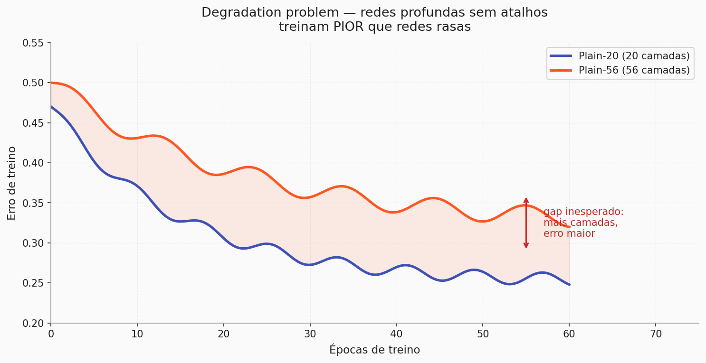
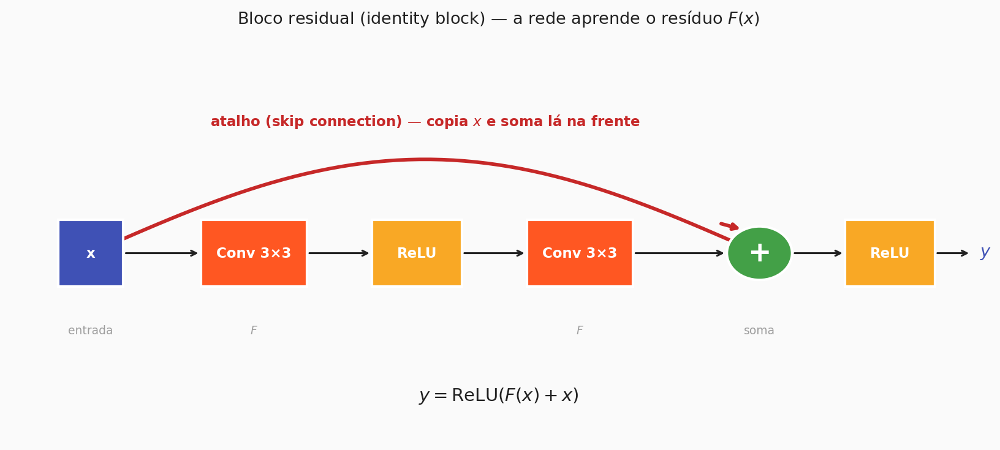
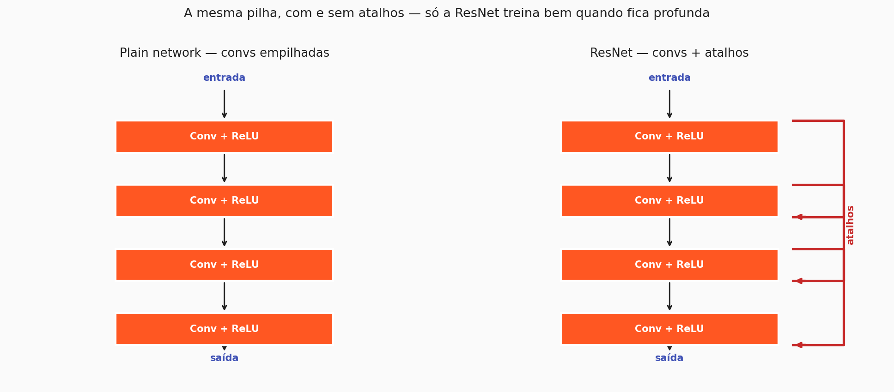

# Redes profundas e ResNets

Na última aula você viu que empilhar convoluções é o caminho natural para uma CNN aprender padrões cada vez mais ricos: camadas rasas detectam bordas e cores, camadas médias juntam isso em texturas e partes, camadas profundas reconhecem objetos inteiros. A conclusão parece óbvia — **mais profundo, melhor**. Se cinco camadas detectam bordas, vinte camadas devem detectar coisas muito mais interessantes, e cem deveriam ser imbatíveis.

Era isso que o mundo achava até **2015**. Só que, quando alguém efetivamente tentou empilhar cinquenta, cem, cento e cinquenta convoluções uma em cima da outra, descobriu-se algo estranho: **a rede simplesmente não treinava**. Esta página explica por que isso acontece e como uma mudança arquitetural surpreendentemente simples destravou a era das redes realmente profundas.

---

## 1. O sonho da profundidade

A intuição de que "mais profundo é melhor" não sai do nada. Uma CNN com $k$ camadas consegue compor $k$ transformações não-lineares sobre a imagem. Quanto mais composição, maior a capacidade de abstração — em teoria, dobrar o número de camadas dobra a riqueza de padrões que a rede consegue representar.

E havia razão adicional para otimismo. Se você já tem uma rede de 20 camadas que funciona, adicionar **mais** camadas em cima dela **deveria**, no pior caso, produzir uma rede que empata: bastaria que as camadas extras aprendessem a função identidade (ou seja, "não mexa em nada") e o resto ficaria igual.

A prática mostrou que essa expectativa estava errada.

---

## 2. Quando o sonho quebra — degradation problem

Em 2015, o paper que originou a ResNet documentou o resultado: redes "planas" (plain networks) com **56 camadas** treinavam **pior** que redes planas com **20 camadas** — não na validação, e sim no **treino**. Não era overfitting (se fosse, o erro de treino cairia e só o de teste subiria). Era algo mais estrutural.

Esse comportamento ganhou nome: **degradation problem**. Profundidade excessiva, sem os cuidados certos, passa a atrapalhar o treinamento em vez de ajudar. E ele não é culpa de um fator só — é uma combinação de dois problemas que se reforçam.

---

## 3. Por trás do problema — vanishing gradient e identidade difícil

O primeiro culpado você já viu em contextos rasos:

- **Vanishing gradient** — no backpropagation, o gradiente é multiplicado pelas derivadas das camadas ao longo do caminho de volta. Em redes muito fundas, esse produto encolhe camada por camada. Quando chega nas primeiras camadas da rede, o gradiente é praticamente zero, e elas param de aprender.

O segundo é mais sutil, e é específico da ideia de "adicionar camadas":

- **Aprender a identidade é difícil.** Pode soar estranho — afinal, identidade é a transformação mais simples que existe, não? Acontece que **uma pilha de convoluções + ReLU** não tem um caminho fácil para reproduzir $H(x) = x$. Para conseguir isso, cada kernel teria que ser ajustado com muita precisão, e os ReLUs ainda zeram a metade negativa. Resultado: no ponto onde a rede extra deveria "apenas não fazer nada", ela acaba fazendo alguma bobagem, e a rede toda piora.

A resposta da ResNet ataca os dois problemas de uma vez — e a ideia, visto de longe, é quase injusta de simples.

---

## 4. A conexão residual — aprender a correção, não tudo

Até aqui a pergunta era: *como fazer um bloco de convoluções aprender a transformação $H(x)$?*

A ResNet vira a pergunta: *e se a rede aprendesse apenas **o quanto a saída difere da entrada** — o resíduo — e a gente somasse a entrada no final?*

Formalmente, se a saída desejada é $H(x)$, redefinimos o problema como:

$$F(x) = H(x) - x \quad\Longleftrightarrow\quad H(x) = F(x) + x$$

Em palavras: em vez de aprender $H$ diretamente, a rede aprende só **a correção** $F(x)$ que, somada a $x$, produz o resultado final. Essa soma acontece por meio de um **atalho** — a famosa *skip connection* — que copia a entrada e a injeta lá na frente:

$$y = \mathrm{ReLU}(F(x) + x)$$

Esse bloco é chamado de **identity block** — "identity" porque o atalho é uma cópia literal de $x$. A fórmula acima é o coração da ResNet, e todo o resto são variações em torno dela.

!!! info "E quando as dimensões mudam? — convolutional block"
    O identity block só funciona quando $x$ e $F(x)$ têm **a mesma forma** (mesmas dimensões espaciais e mesmo número de canais) — afinal, só assim a soma $F(x) + x$ faz sentido. Mas qualquer CNN real muda dimensões ao longo da rede: pooling encolhe resolução, convoluções com mais filtros aumentam a profundidade de canais. Nesses pontos de transição, entra em cena o **convolutional block**: uma variação do bloco residual em que o atalho passa por uma `Conv2D(1×1)` para **adaptar dimensões** antes da soma. Na prática, uma ResNet-50 alterna: identity blocks dentro de um "stage" onde a resolução fica constante, interrompidos por um convolutional block sempre que a resolução cai ou o número de filtros aumenta.

---

## 5. Por que a skip connection funciona

Essa mudança de framing tem duas consequências enormes — e cada uma ataca um dos dois problemas que você acabou de ver.

**1. Aprender a identidade fica quase grátis.** Se a melhor coisa que aquele bloco pode fazer é "não mexer na entrada", basta a rede aprender $F(x) = 0$ — ou seja, zerar os pesos daquelas convoluções. Isso é *muito* mais fácil do que forçar uma pilha de convs a reproduzir $H(x) = x$ pixel a pixel. O resultado é que empilhar blocos residuais "a mais" em cima de uma rede que já funciona **deixou de piorar a rede**.

**2. O gradiente ganha uma via expressa.** O atalho é uma conexão direta entre a saída e a entrada do bloco. No backpropagation, o gradiente que chega na saída pode **passar direto** para a entrada através do atalho, sem ser multiplicado pelas derivadas das convoluções intermediárias. É essa via paralela que faz o vanishing gradient sumir — mesmo em redes com dezenas ou centenas de camadas, o gradiente continua chegando nas primeiras camadas com intensidade suficiente para elas aprenderem.

---

## 6. Plain vs ResNet — o efeito nos diagramas

A diferença entre uma pilha convolucional "plana" e uma ResNet, esquematicamente, é literalmente **adicionar os atalhos**:

Na *plain network*, cada bloco só tem uma forma de influenciar o próximo: passando por todas as convoluções. Na ResNet, existe um caminho alternativo em cada bloco — o atalho — que permite que a informação (no forward) e o gradiente (no backward) **pulem** as convoluções quando isso for a melhor opção.

O efeito pode ser surpreendentemente grande. As redes planas que antes paravam de melhorar depois de 20 camadas passaram a treinar de forma estável com **50, 101, 152 camadas**, e com ganhos consistentes de acurácia em cada salto.

!!! note "🎬 Animação pendente"
    Espaço reservado para GIF mostrando o gradiente fluindo para trás através de um bloco residual — a via expressa do atalho ao lado da via das convoluções.

---

## 7. Fechando — e a ponte para a próxima página

A ResNet abriu uma porta. Ela não é uma única arquitetura, e sim uma **família** — ResNet-18, ResNet-34, ResNet-50, ResNet-101, ResNet-152 — onde o número indica quantas camadas com peso existem, todas construídas empilhando blocos residuais.

Mas a história não para aqui. A ideia do skip connection virou **padrão de projeto** em praticamente toda CNN moderna. Muitas vezes aplicada de formas criativas, muitas vezes combinada com outras otimizações. Uma dessas variações é o **MobileNetV2**, a rede que você vai usar na prática desta aula — ela usa uma versão invertida do bloco residual, desenhada para rodar eficientemente em celular.

Isso nos leva naturalmente à próxima pergunta: *se a ResNet não é a única opção, e cada arquitetura moderna tem compromissos diferentes, qual delas você deve escolher?* É isso que a próxima página discute — um passeio pela evolução das arquiteturas de CNN, com foco em entender os trade-offs que importam quando você sai do paper e vai para o projeto real.

??? question "Teste de intuição"
    - Por que empilhar mais camadas sem atalhos **pode** piorar a rede, mesmo sem overfitting? *(porque as camadas extras não conseguem aprender a função identidade, e o vanishing gradient impede que os pesos mais rasos se ajustem)*
    - No bloco residual, a rede aprende $F(x)$ ou $H(x) = F(x) + x$? *(aprende $F$ — o "resíduo". A soma $F + x$ produz o $H$, mas quem tem pesos treináveis é $F$)*
    - Por que o atalho "resolve" o vanishing gradient? *(porque oferece um caminho no backpropagation que não multiplica as derivadas das convs — o gradiente passa direto por cima delas)*

---

!!! Author
    - **Vitor Salomão**

[← Anterior: Visão Geral](index.md){ .md-button }
[Próxima: Arquiteturas de CNNs →](arquiteturas_cnn.md){ .md-button .md-button--primary }

