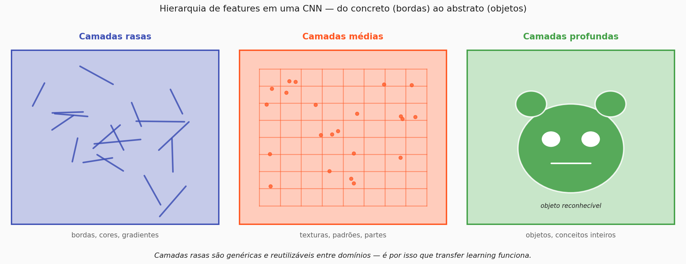
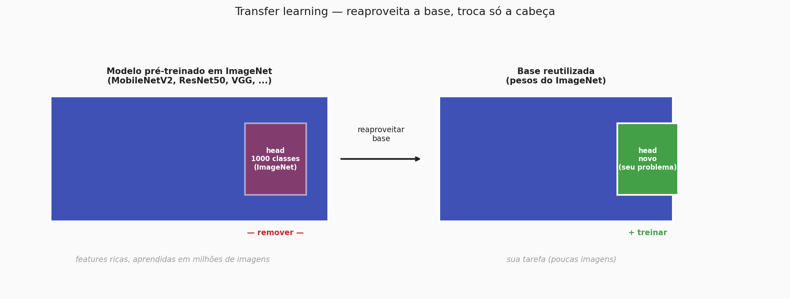
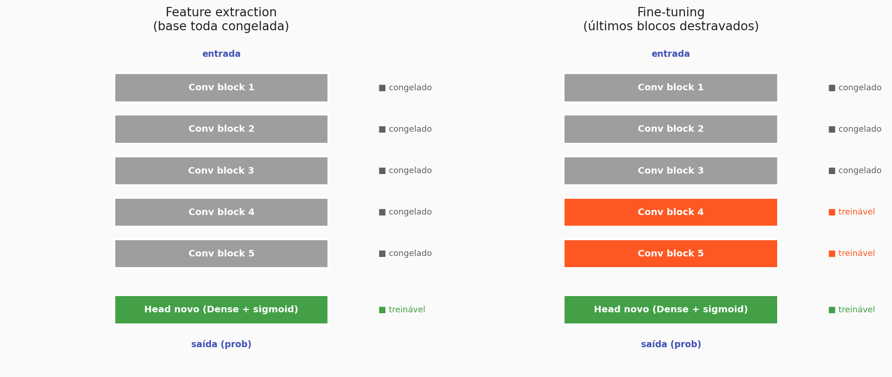
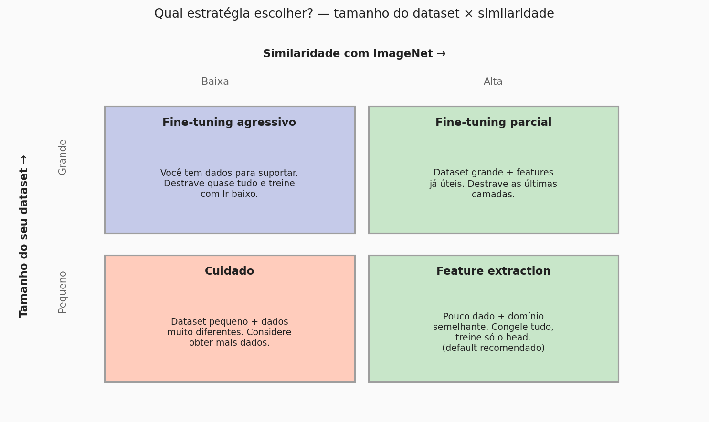
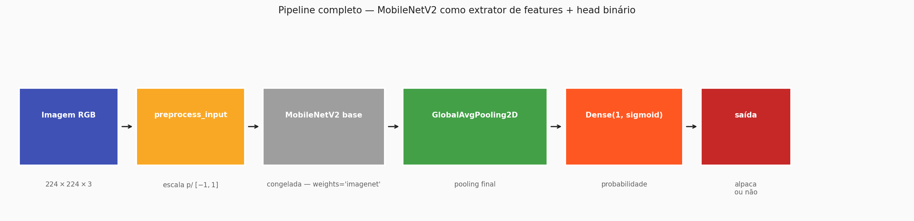

# Transfer Learning

Nas duas páginas anteriores você viu por que CNNs modernas funcionam (skip connections) e por que arquiteturas eficientes como a MobileNetV2 existem (trade-off entre acurácia, tamanho, latência). Agora falta a peça prática: mesmo que a arquitetura caiba no seu compute, **treiná-la do zero continua caro**. MobileNetV2 tem "só" 3,5M de parâmetros — mas para aqueles pesos aprenderem features visuais úteis do zero, você precisaria de um dataset gigante, não das 200 ou 500 imagens que um projeto aplicado típico tem à disposição.

A saída canônica é o tema desta página: **aproveitar o trabalho de quem já treinou uma CNN poderosa em milhões de imagens**. Esse reaproveitamento tem nome — **transfer learning** — e é o padrão-ouro em visão computacional aplicada hoje.

---

## 1. Por que transfer learning funciona — hierarquia de features

Antes da prática, vale entender por que essa ideia faz sentido. Uma CNN bem treinada não aprende features todas iguais; ela aprende uma **hierarquia**:



- **Camadas rasas** aprendem detectores de **bordas, cores, gradientes**. Essas features são **genéricas** — elas são úteis em praticamente qualquer imagem natural, seja uma foto de gato, de raio-X ou de satélite.
- **Camadas médias** juntam bordas em **texturas e partes**: pelo, escamas, rodas, olhos. Ainda bastante reutilizáveis entre domínios, mas já começam a ficar mais específicas ao tipo de imagem em que foram treinadas.
- **Camadas profundas** montam partes em **objetos e conceitos inteiros**. São as mais especializadas: um detector de "cabeça de golden retriever" não é diretamente útil se seu problema são radiografias.

A consequência prática é direta: quando você pega uma CNN treinada em ImageNet e a aplica em um problema novo de imagens naturais, as camadas **rasas e médias funcionam quase como estão** — elas já aprenderam o que precisavam aprender. Só as camadas finais (e o classificador) precisam ser trocadas ou ajustadas para o seu problema.

É exatamente disso que transfer learning se aproveita.

---

## 2. O que é transfer learning

A ideia é a seguinte: alguém já fez o trabalho pesado. Grupos de pesquisa treinaram modelos em datasets gigantes — em geral, o **ImageNet** (1,28 milhão de imagens, 1000 classes) — e publicaram os pesos resultantes. Esses modelos **já sabem** extrair features visuais úteis.

Em vez de aprender tudo isso do zero, você **pega o modelo pré-treinado e reaproveita a base**. A única coisa que você realmente precisa aprender é o **"topo"** — as últimas camadas que traduzem aquelas features em **uma resposta para o seu problema específico**.



A metáfora mais útil é a de um especialista. Um dermatologista que passou 10 anos olhando para peles não precisa reaprender a enxergar formas, bordas e cores para te ajudar a identificar uma pinta suspeita. Ele já tem esses "detectores" consolidados, e só precisa ajustar o julgamento final ao seu caso. Transfer learning é exatamente isso: a base é o especialista, e o *head* (a camada final) é o ajuste ao seu problema.

Existem duas maneiras principais de fazer isso, que diferem em **quanto da base você deixa ser mexida durante o treino**.

---

## 3. Feature extraction — a versão mais simples

A forma mais conservadora de transfer learning é chamada de **feature extraction**:

1. Pegue o modelo pré-treinado.
2. **Remova a última camada** — o classificador de 1000 classes do ImageNet, que não serve pra você.
3. **Congele todos os pesos da base** — ela não vai ser atualizada durante o treino.
4. **Adicione um novo head** adequado ao seu problema (por exemplo, uma `Dense(1, activation='sigmoid')` para classificação binária).
5. Treine apenas o head.

O modelo pré-treinado, nesse caso, funciona como um **extrator fixo de features**. Você está basicamente dizendo: "confio nas features que esse modelo aprendeu em ImageNet; só quero treinar como **combiná-las** para a minha tarefa".

Em Keras, com MobileNetV2 como base, o pipeline fica assim:

```
from tensorflow import keras
from tensorflow.keras import layers

# 1. Carrega a base pré-treinada, sem o classificador final
base_model = keras.applications.MobileNetV2(
    input_shape=(224, 224, 3),
    include_top=False,      # remove o head de 1000 classes
    weights='imagenet',
)

# 2. Congela TODOS os pesos da base
base_model.trainable = False

# 3. Monta o modelo completo: base + head próprio
inputs = keras.Input(shape=(224, 224, 3))
x = keras.applications.mobilenet_v2.preprocess_input(inputs)
x = base_model(x, training=False)       # training=False é importante com BN!
x = layers.GlobalAveragePooling2D()(x)  # resume cada feature map em 1 número
outputs = layers.Dense(1, activation='sigmoid')(x)

model = keras.Model(inputs, outputs)
model.compile(optimizer='adam',
              loss='binary_crossentropy',
              metrics=['accuracy'])
```

Esse modelo tem **milhões** de parâmetros na base — todos congelados — e **apenas algumas dezenas** de parâmetros treináveis no head (basicamente só o `Dense(1)`). `model.summary()` vai deixar isso explícito: `Trainable params` muito pequeno, `Non-trainable params` muito grande.

!!! warning "Sobre o `preprocess_input`"
    Cada família de modelos pré-treinados espera **a entrada em um formato específico** — que reflete exatamente o pré-processamento usado no treino original em ImageNet. Para o MobileNetV2, isso significa escalar os pixels para o intervalo **[-1, 1]** (e não [0, 1]).

    **Nunca use `/255` aqui** — use `keras.applications.mobilenet_v2.preprocess_input`. Se errar, a base vê entradas em uma escala para a qual ela não foi treinada, e as features ficam lixo.

!!! info "Por que `training=False` mesmo durante treino?"
    O MobileNetV2 (como muitas CNNs modernas) usa **Batch Normalization**. BN se comporta diferente em treino (acumula estatísticas do mini-batch) e em inferência (usa médias móveis aprendidas no treino original). Quando a base está congelada, a gente **não quer** que ela atualize essas estatísticas — só o head deve ser treinado. Passar `training=False` garante que a BN use as médias já aprendidas no ImageNet.

---

## 4. Fine-tuning — quando feature extraction não basta

Feature extraction é rápido, seguro e geralmente dá resultados surpreendentemente bons. Mas ele tem um limite: as features da base foram aprendidas para **ImageNet**, e se o seu domínio é **muito diferente** de ImageNet (imagens médicas, imagens de satélite, radiografias), as features das camadas mais profundas podem não estar exatamente calibradas para o seu problema.

Nesse caso, o próximo passo é **fine-tuning**: destravar **as últimas camadas** da base e permitir que elas se ajustem ao seu dataset, enquanto mantém as primeiras camadas congeladas.



A lógica vem direto da hierarquia de features que você viu na seção 1: as camadas iniciais aprendem detectores **genéricos e reutilizáveis** (bordas, cores, texturas) — essas você **quer preservar**. As camadas finais aprendem features **mais específicas ao dataset de origem** — essas você pode reajustar.

Na prática, fine-tuning é quase sempre feito em **duas fases**:

1. **Fase 1 — feature extraction** (já com todo o head treinado). Isso garante que o head tenha pesos razoáveis antes de começar a mexer na base.
2. **Fase 2 — fine-tuning propriamente dito**. Destrava as últimas $N$ camadas da base e continua treinando com um `learning_rate` **muito menor**.

```
# ── Fase 1 já rodou: base congelada, head treinado por algumas épocas
base_model.trainable = False
model.fit(...)  # apenas head é ajustado

# ── Fase 2: destrava a base (ou apenas as últimas camadas)
base_model.trainable = True

# Opcional: congele de novo tudo menos as últimas N camadas
fine_tune_at = 100  # índice da camada a partir da qual descongelar
for layer in base_model.layers[:fine_tune_at]:
    layer.trainable = False

# Recompile com learning rate MUITO menor — senão a base esquece o que sabia
model.compile(
    optimizer=keras.optimizers.Adam(learning_rate=1e-5),
    loss='binary_crossentropy',
    metrics=['accuracy'],
)

# Continua treinando — agora head + últimas camadas da base
model.fit(...)
```

!!! danger "O erro mais comum no fine-tuning"
    **Esquecer de abaixar o learning rate.** Se você destrava a base e continua treinando com o `lr` que estava usando no head, os pesos pré-treinados são sobrescritos violentamente nos primeiros mini-batches — é o chamado **catastrophic forgetting**. A rede esquece o que sabia e fica pior do que antes.

    Regra prática: no fine-tuning, use um learning rate **10 a 100 vezes menor** que o usado no feature extraction. `1e-5` é um bom ponto de partida.

!!! warning "Sempre recompile depois de mexer em `trainable`"
    Quando você muda `base_model.trainable`, o Keras só passa a refletir isso de fato **depois de um `model.compile()`**. Se você esquecer, o `fit()` seguinte pode silenciosamente não estar fazendo o que você acha que está.

---

## 5. Qual estratégia usar — a matriz de decisão

A escolha entre feature extraction e fine-tuning depende de duas coisas: **quanto dado você tem** e **quão similar seu problema é a ImageNet**.



Na prática, para datasets pequenos (algumas centenas de imagens, que é o caso típico em projetos aplicados), o **default é feature extraction**. Ele é mais rápido, mais estável, menos propenso a overfitting, e quase sempre dá um baseline respeitável. Só parta para fine-tuning quando tiver evidência concreta de que feature extraction não está bastando — por exemplo, a acurácia de validação paralisou abaixo do aceitável e a rede não está overfitando (se estivesse, você resolveria com regularização, não com fine-tuning).

---

## 6. Data augmentation — um vizinho útil

Com dataset pequeno, outro truque padrão para espremer mais resultado do mesmo dado é **data augmentation**: expandir artificialmente o dataset aplicando transformações aleatórias (espelhamento, rotação, zoom, variação de brilho) a cada imagem no treino. A rede acaba vendo "mais exemplos", o que reduz overfitting.

!!! tip "Em Keras, use camadas de augmentation dentro do modelo"
    O Keras tem camadas prontas — `RandomFlip`, `RandomRotation`, `RandomZoom`, `RandomContrast` — que você pluga **no início do modelo**, antes do `preprocess_input`. Elas só atuam em modo de treino (`training=True`) e são ignoradas em inferência. Você provavelmente vai precisar delas no notebook da prática.

---

## 7. O pipeline completo

Juntando todas as peças, a arquitetura que você vai usar na prática fica assim:



- **Imagem RGB** (224×224×3, o tamanho padrão do MobileNetV2 — também funciona com 160×160)
- **(Opcional)** camadas de data augmentation
- **`preprocess_input`** do próprio módulo do MobileNetV2 (escala para [-1, 1])
- **MobileNetV2 base** carregada com `weights='imagenet'`, `include_top=False`, **congelada**
- **GlobalAveragePooling2D** — reduz cada feature map em um único valor, produzindo um vetor compacto
- **Dense(1, sigmoid)** — probabilidade de pertencer à classe alvo (alpaca / não alpaca)

O modelo inteiro tem **menos de 3 mil parâmetros treináveis** — mesmo com a base de ~3,5M parâmetros, tudo congelado. Isso é feature extraction puro, e é exatamente o que você quer com poucas imagens.

---

## 8. Para a prática

Agora as peças conceituais estão todas no lugar. Na prática, o que você vai executar no notebook é basicamente esta sequência:

1. **Carregar o dataset** com `image_dataset_from_directory()` (pastas `alpaca/` e `not_alpaca/` servidas automaticamente).
2. **Aplicar `preprocess_input` do MobileNetV2** e, opcionalmente, camadas de data augmentation.
3. **Construir o modelo** colando `MobileNetV2(include_top=False, weights='imagenet', trainable=False)` + `GlobalAveragePooling2D` + `Dense(1, sigmoid)`.
4. **Compilar** (Adam, `binary_crossentropy`, `accuracy`) e **treinar** por algumas épocas — este é o feature extraction puro.
5. **Avaliar** na validação; plotar curvas de loss e accuracy.
6. *(Opcional)* **Fine-tuning**: destravar as últimas camadas, baixar o `lr` para `1e-5`, recompilar, continuar treinando.

Cada um desses passos mapeia diretamente para algum conceito que você viu nesta página. Quando algum comportamento estranho aparecer (acurácia travada, validação pior que treino, predições aleatórias), **volte aqui** — quase sempre o problema é um dos erros clássicos descritos acima: `/255` no lugar de `preprocess_input`, esquecimento de `training=False`, fine-tuning com `lr` grande, ou `compile()` ausente depois de trocar `trainable`.

??? question "Antes de seguir, confira sua intuição"
    - O que acontece se, em feature extraction, você esquecer de setar `base_model.trainable = False`? *(todos os pesos da base são treinados junto — e como o head começa aleatório, os gradientes iniciais são enormes e bagunçam a base pré-treinada. Catastrophic forgetting.)*
    - Você tem 50 imagens de categorias muito similares a ImageNet. Feature extraction ou fine-tuning? *(feature extraction — pouco dado + alta similaridade = default puro)*
    - Por que **não** dividir a imagem por 255 antes de alimentar o MobileNetV2? *(porque o MobileNetV2 foi treinado com entradas no intervalo [-1, 1], não [0, 1]. Use sempre `preprocess_input`.)*
    - Por que transfer learning funciona "tão bem" em projetos pequenos? *(porque as camadas rasas/médias da base pré-treinada já aprenderam features genéricas — bordas, texturas, partes — que são reutilizáveis em praticamente qualquer problema de imagem natural; você só treina o ajuste final ao seu domínio específico)*

---

!!! Author
    - **Vitor Salomão**

<div class="handout-nav" markdown>
[← Anterior: Arquiteturas de CNNs](arquiteturas_cnn.md){ .md-button }
[Próxima: Prática →](pratica_handout.md){ .md-button .md-button--primary }
</div>
